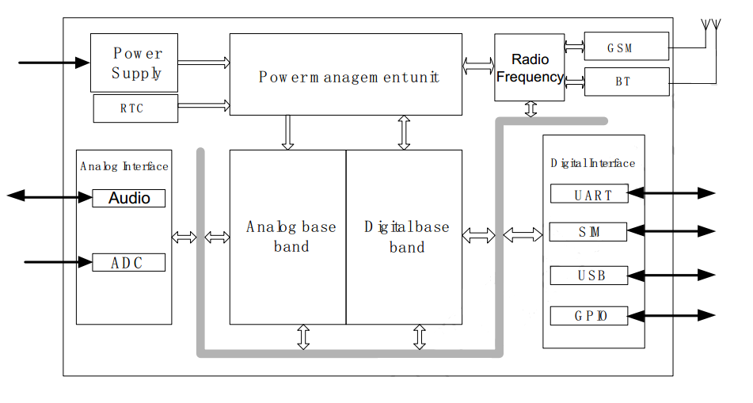

---
title: "Remote Sensing and control of New Automatic Scan device " 
author: \textbf{Member} \newline
        DO Duy Huy Hoang \newline
        \newline
        \textit{University of Science and Technology Hanoi} \newline 
        \textit{ICT Department}
date: "2019-04-05"
logo: "logo.pdf"
logo-width: 200
titlepage: true
...

\newpage{}
\tableofcontents
\newpage{}

## I. Introduction

**The objective of the project**: Make a communication and control system that operates the scanner both from far distance through GSM and transfer data from short distance through Bluetooth. 
This system helps users to control the scanner from their android phone:
* Checking basic information: Time, storage, number of images, battery voltage and time + frequency to take picture.
* Change the DPI number (Dots per inch) which is a measurement of images’ quality.
* Change time frequency to take picture (ex: every 2 hours, each day or 16h00 everyday).


## II. Sim800
  \begin{figure}
  \centering
  {\includegraphics[width=4.3in]{6.jpg}}
  \caption{Schematic}
  \end{figure}

Sim800 uses 12V 2A or more power supply with stable performance because Line level for MIC29302AWU is 3A ( You can read about MIC29302AWU datasheet in [**here**](http://ww1.microchip.com/downloads/en/DeviceDoc/20005685A.pdf))
If the amperage is lower than 1A, it will happen to the case sim800 cannot recognize sim ( LED light will blink fast in sequence ). Else, LED light will blink slower and with a delay.
Sim800 only works with Viettel, Mobifone and Vinafone in VietNam.

### A. Sim800 Block diagram

Basic sim supports a lot of different functions like read on ADC or Audio values. Digital pins are used for interfacing with other UART or USB devices in addition to the GPIO pins that are used for the purpose of the programmer. Radio frequency blocks for sim reception via GSM antennas.



### B. Sim800 Schematic

Sim800 is powered by **MIC29302AWU**, sim800 is connected to sim card via SIM800's C7 (I / O) - 15 (SIM_DATA) sim card for data transfer. C3 (CLK) - 16 (SIM_CLK) to carry data. C2 (RST) - 17 (SIM_RST) and C1 (VCC) - 18 (SIM_VDD). Pin 32 (GSM_ANT) is connected to the antenna. 
\
Notice the two pin number 1 (UART1_TXD) and the pin number 2 (UART1_RXD) to communicate with the microcontroller. Microcontroller will communicate with SIM800 by UART communication standard, Sim800 communicates with SIM card with SIM_DATA pin.

  \begin{figure}
  \centering
  {\includegraphics[width=6.5in]{2.png}}
  \caption{Schematic}
  \end{figure}

## III. Sim800 and Raspberry Pi
  \begin{figure}
  \centering
  {\includegraphics[width=4.1in]{5.jpg}}
  \caption{Sim800 and Raspberry Pi 3B+}
  \end{figure}

* RPI SIM800 Shield provides Dual-band GSM / GPRS 900 / 1800MHz, which can transmit SMS, Data.
* When you connect RPI SIM800 Shield + Raspberry Pi, you power the RPI SIM800 Shield and also power the Raspberry Pi.
* Input power from 9-12V / 2A.
* You can power the PIC SIM800 Shield via a DC power supply, or via the jack on the sim module ( See the figure below )
* If you power the Shield through a DC power supply, you can get a 9-12V output power supply at the bridge.
  \begin{figure}
  \centering
  {\includegraphics[width=4.3in]{9.png}}
  \caption{Sim800 Power connection}
  \end{figure}

* You can also starte or stoppe the SIM800 via pushbutton on the circuit or use PWK pin control.
* The power source (IC) on the shield allows the user to use the MCU to control the RPI SIM800 Shield, via the C_PW control pin.
  * C_PW = HIGH: The source IC will stop the power supply for RPI SIM800 Shield.
  * C_PW = LOW: The source IC continues to power the RPI SIM800 Shield.
* You can use any Raspberry Pi IO pins to control C_PW pins; The default C_PW pin is connected to the GPIO27 pins of Raspberry Pi, using a jump connection between C_PW and IO27.

  \begin{figure}
  \centering
  {\includegraphics[width=3in]{gpio.png}}
  \caption{Sim800 GPIO}
  \end{figure}

* Raspberry Pi and Sim800 **connection**

| Sim800 	| Raspberry Pi 	|
|--------	|--------------------------------------------------------------------------------------	|
| ST 	| Connect to the input pins of the MCU to read RPI SIM800A Shield active / idle state. 	|
| C_PW 	| Power supply for RPI SIM800A Shield. 	|
| PWK 	| Sim800A on / off switch 	|
| M_RX 	|  RX of MCU 	|
| M_TX 	|  TX of MCU 	|
| GND 	|  GND of MCU 	|
| P_TX 	|  Raspberry Pi UART0 TX 	|
| P_RX 	|  Raspberry Pi UART0 RX 	|
| IO17 	|  Raspberry Pi GPIO17 	|

| RPI Sim800 	| Raspberry Pi 	|
|------------	|----------------------------	|
| C_PW 	| GPIO 27 	|
| PWK 	| GPIO 17 	|
| TxD 	| RxD (GPIO 15) 	|
| RxD 	| TxD (GPIO 14)   |

## IV. Program
**Dependencies**

* Linux >= 2.6.13
* Python >= 2.4 (including Python 3.x)
* Bash
* An USB Huawei Dcom or GSM module 800

**Preparing**

```bash
sudo apt-get install python-pip
sudo apt-get install python-serial
```
* We need change file system modes of files and directories. The modes include permissions and special modes. Each shell script must have the execute permission. Mode can be either a symbolic representation of changes to make, or an octal number representing the bit pattern for the new mode bits.
```bash
chmod +x info.sh
chmod +x changeTime.sh
chmod +x changeDPI.sh
```

* Edit phone number for sending a message ( same with call function )

```python
def GSM_MakeSMS(data):
    print ("Nhan tin...\n")
    ser.write(b'AT+CMGS=\"0123456789\"\r\n')    # change your phone number here
    time.sleep(5)
    ser.write(data)
    ser.write(b'\x1A')
    time.sleep(5)
    return
```
```python
def GSM_MakeCall():
    print ("Goi dien...\n")
    ser.write(b'ATD0989612156;\r\n')  # Goi dien toi sdt 012345678
    time.sleep(20)
    ser.write(b'ATH\r\n')
    time.sleep(2)
    return
```

**Main Function Diagram**
  \begin{figure}
  \centering
  {\includegraphics[width=5.5in]{main.png}}
  \caption{Program Overview}
  \end{figure}

**Arduino**
The Raspberry Pi cannot read and convert the analog signal so We use an Arduino to read directly the voltage output from the power source.

**Auto run at start up with crontab**
Cron is a Unix, solaris, Linux utility that allows tasks to be automatically run in the background at regular intervals by the cron daemon.
Cron is a daemon which runs at the times of system boot from /etc/init.d scripts. If needed it can be stopped/started/restart using init script or with command service crond start in Linux systems. Cron job or cron schedule is a specific set of execution instructions specifing day, time and command to execute. crontab can have multiple execution statments.

##### Crontab Restrictions

You can execute crontab if your name appears in the file /usr/lib/cron/cron.allow. If that file does not exist, you can use
crontab if your name does not appear in the file /usr/lib/cron/cron.deny.
If only cron.deny exists and is empty, all users can use crontab. If neither file exists, only the root user can use crontab. The allow/deny files consist of one user name per line.
\
**Crontab Commands**

* crontab -e:  Edit crontab file, or create one if it doesn’t already exist.
* crontab -l: crontab list of cronjobs , display crontab file contents.
* crontab -r: Remove your crontab file.
* crontab -v: Display the last time you edited your crontab file. (This option is only available on a few systems.)

```bash
sudo apt-get install crontab
```
To config crontab use:
```bash
sudo crontab -e
```
* Add this line to automatic run the program at startup
```
@reboot bash /home/pi/sim800/launcher.sh
```
**Current list of available commands**
```
dpi {dpi numer}
- Example: dpi 200 - Change DPI for the scanner 
```
```
time {crontime number}
- Example: time */2 * * * * 
- Change the time for scanner cronjob
```
```
daily
- Request for the daily report
``` 
```
help
- List available commands
```

**System Report Example**
```
Tue 19 Mar 00:47:09 +07 2019
Images JPG: 68
Images PNG: 14
Free storage: 3.7G Mb 3836652
DPI: 100
Voltage: 8.25^M$
Time to take Picture: */5 * * * *$
```